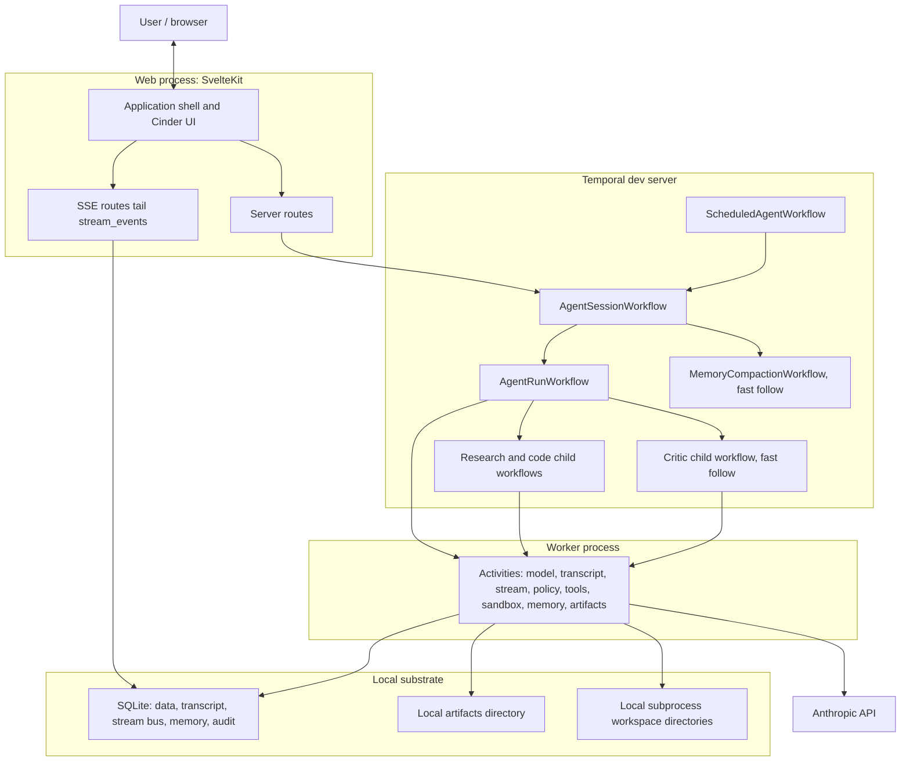
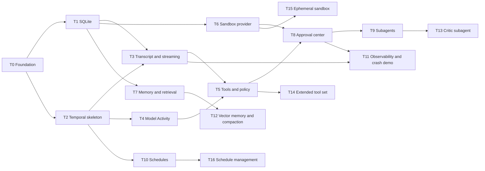

# Stardust POC Architecture

This document is the repository-level source of truth for the local Stardust proof of concept. Every build task should read this file before editing code, then verify the task-specific acceptance criteria against the current checkout.

The vault notes that informed this document are:

- `/Users/stevekinney/Vaults/Lost Gradient/Stardust/Stardust — POC Plan.md`
- `/Users/stevekinney/Vaults/Lost Gradient/Stardust/Stardust — Architecture.md`
- `/Users/stevekinney/Vaults/Lost Gradient/Stardust/Stardust — UI Requirements Brief.md`
- `/Users/stevekinney/Vaults/Lost Gradient/Stardust/POC Tasks/*.md`

> [!NOTE]
> Some vault task notes still use `pnpm` in commands. This repository uses Bun. Use the Bun equivalents in this document unless a task has a concrete reason to do otherwise.

## Product Goal

Stardust is a local, single-user proof of concept for a Temporal-native durable agent harness. The POC must prove that the agent loop is real: streaming, tool use, human approval, memory, subagents, schedules, and crash recovery all run on one laptop without cloud infrastructure beyond the model provider.

The honest minimum is:

- **One SvelteKit application:** The web user interface, server routes, and Temporal client live in one application.
- **One Temporal Worker process:** The Worker hosts the workflow bundle and narrowly owned named activity task queues.
- **One Temporal dev server:** `temporal server start-dev` provides durable orchestration and Temporal Web locally.
- **One SQLite file:** Application data, canonical transcript, stream bus, memory, schedules, and audit records live in SQLite.
- **Two local directories:** Artifacts live under `~/.stardust/artifacts`; per-session workspaces live under `~/.stardust/workspaces`.
- **One unavoidable external call:** The model provider is external. The default target is Anthropic.

Everything else is local. There is no authentication, tenancy, hosted deployment, Redis, Neon, R2, Tensorlake, billing system, or marketplace in the POC.

## Current Repository Snapshot

The current checkout already contains parts of the early task plan:

- SvelteKit, TypeScript, Bun, ESLint, Prettier, Vitest, Playwright, Drizzle, Temporal SDKs, and Cinder are installed.
- `@sveltejs/adapter-node` is configured.
- `src/worker/main.ts` starts a single Worker process that hosts the orchestrator, model, tools, sandbox, and memory task queues. Each activity task queue registers only the activities it owns.
- `src/workflows/agent-session.workflow.ts` and `src/workflows/agent-run.workflow.ts` contain the early no-tool session and run skeleton.
- `src/routes/api/sessions/[sessionKey]/turn/+server.ts` starts or reuses an `agent-session:{sessionKey}` workflow and submits a turn by Workflow Update.
- `src/lib/server/db/schema.ts`, migrations, migration tests, and a runs repository exist for the SQLite schema.
- `eslint-plugin-temporal` plus project-specific restricted imports enforce the workflow determinism boundary.

Do not treat those tasks as complete just because files exist. Each task executor must verify the relevant gates and either finish the work or document the blocker.

## Runtime Architecture



The load-bearing boundary is Temporal determinism: Workflow code decides and waits, but never performs side effects. SQLite, model calls, filesystem access, subprocess execution, `armorer`, and `conversationalist` all belong in Activities or server-only helpers called by Activities.

## Repository Layout

The POC stays a single SvelteKit application:

```text
src/
  routes/
    api/                         SvelteKit endpoints that call the Temporal Client
  lib/
    components/                  Cinder-based user interface components
    types/                       Serializable contracts and schemas
    server/
      temporal/                  Client, task queue names, schedule helpers
      db/                        Drizzle schema, migrations, repositories
      stream/                    SQLite stream bus and SSE helpers
      agent-core/                Context assembly, budgets, model normalization
      tools/                     Armorer tool descriptors
      policy/                    Risk, approval, allowlists, SSRF, prompt injection rules
      sandbox/                   Local subprocess sandbox provider
      memory/                    Memory store and retrieval
      artifacts/                 Local artifact store
  workflows/                     Deterministic Temporal workflow code
  activities/                    Side-effecting Activity implementations
  worker/                        Temporal Worker bootstrap
drizzle/                         Generated migrations
scripts/db/                      Database migration runner
```

The Worker must not rely on SvelteKit-only aliases such as `$lib`. Shared code imported by Worker or Activity code must be reachable through plain relative paths or a TypeScript path alias that Node and `tsx` can resolve.

## Module Boundaries

| Layer            | Lives in                           | May import                                                        | Must not import                                                                                       |
| ---------------- | ---------------------------------- | ----------------------------------------------------------------- | ----------------------------------------------------------------------------------------------------- |
| User interface   | `src/lib/components`, `src/routes` | Cinder, serializable types, route data                            | Database client, Activity implementations, Workflow internals                                         |
| Server routes    | `src/routes/api`                   | Temporal Client, repositories, serializable types                 | Activity implementations directly, model SDKs in browser paths                                        |
| Workflows        | `src/workflows`                    | `@temporalio/workflow`, serializable types, deterministic helpers | Node APIs, SvelteKit, database, filesystem, model SDKs, `armorer`, `conversationalist`, `$lib/server` |
| Activities       | `src/activities`                   | server helpers, database, model SDKs, tools, sandbox, memory      | Svelte components                                                                                     |
| Server libraries | `src/lib/server`                   | Node APIs and server dependencies                                 | Svelte components, Workflow code                                                                      |
| Types            | `src/lib/types`                    | serializable contracts only                                       | SDK clients, database client, UI libraries                                                            |

The boundary is enforced with `eslint-plugin-temporal` and the project `no-restricted-imports` configuration for workflow files. Never silence a workflow rule to pass a gate. Move the side effect into an Activity.

## Identity and Workflow IDs

The POC is single-user and has no authentication.

- A session is a resumable conversation thread.
- The session workflow ID is `agent-session:{sessionKey}`.
- `sessionKey` is server-minted and validated before it enters a Workflow ID, route, workspace path, or artifact key.
- A run workflow ID is `agent-run:{runId}` for the current skeleton. If a later task chooses a more descriptive run ID shape, it must keep run IDs stable and document the change.
- The session workflow serializes turns, routes approvals and steering, tracks the active run, and completes after the idle timeout.

Reintroducing authentication later is additive: restore users, tenants, memberships, tenant-scoped keys, and route guards before exposing the system beyond localhost.

## Workflow Topology

**AgentSessionWorkflow:** Owns the session lane. It accepts `submitTurn` Updates, exposes state Queries, keeps one active run at a time, queues additional turns, routes approval decisions, routes steering, handles interrupt, tracks memory references, and performs Continue-As-New only between runs.

**AgentRunWorkflow:** Owns one prepared turn. It assembles context through Activities, calls the model through an Activity, validates tool calls, enforces policy, waits durably for approval, executes tools through Activities or child workflows, publishes stream events, persists canonical transcript events, and produces memory candidates. It also executes `timer.wait` itself as a durable `condition()` wait; an in-band `interruptRunSignal` (sent by the session before its hard-cancel safety net) lets an interrupted wait persist a partial-wait tool result through the normal path before the run records `cancelled`.

**Subagent workflows:** Research and code subagents are child workflows in the demo path. They share the parent run budget and render as nested lanes. The critic subagent is advisory and is a fast follow.

**MemoryCompactionWorkflow:** A fast follow that summarizes long sessions, advances the transcript cursor, updates memory references, and preserves the distinction between session memory, durable memory, and action-sensitive memory.

**ScheduledAgentWorkflow:** A schedule fire submits a turn into a target session through `submitTurn`. Scheduled work must never bypass the session workflow.

## Data Architecture

SQLite is the durable store and the live stream bus. The schema intentionally has no `users`, `tenants`, `memberships`, or `tenant_id` columns.

Core tables:

- `sessions`: Logical session metadata and session projection.
- `runs`: Run status, model, usage, budget snapshot, and result.
- `transcript_events`: Canonical truth for messages, tools, approvals, lifecycle, and memory notices.
- `stream_events`: Live SSE bus with autoincrement `id` and per-run `sequence`.
- `audit_events`: Policy, approval, cancellation, retry, and operator actions.
- `memory_notes`: Session, durable, and action-sensitive memory notes.
- `tool_invocations`: Provider-agnostic tool ledger with idempotency metadata.
- `idempotency_ledger`: Prevents duplicate side effects on retry.
- `artifacts`: Metadata for local files, patches, screenshots, logs, and large outputs.
- `sandboxes`, `sandbox_snapshots`, `sandbox_commands`: Local subprocess workspace state.
- `schedules`: User interface projection of Temporal Schedules.
- `workflow_executions`: App-side evidence rows for workflow ID, Temporal run ID, workflow type, task queue, parent workflow, status, history length, and Continue-As-New linkage.
- `schedule_fire_events`: Durable linkage from a Temporal Schedule fire to the scheduled workflow, target session update, accepted run ID, status, and overlap policy.

The SQLite client must open the database in WAL mode so the Worker can write while SSE routes read. `transcript_events` is never trimmed. `stream_events` may be trimmed after a completed run once canonical state can reconstruct the view.

Run inspection is a teaching projection over durable evidence, not a second source of truth. `RunInspectorProjection` maps SQLite rows plus Temporal workflow history, when reachable, into readable Temporal primitives: Workflows, Activities, Task Queues, Updates, Signals, Timers, Child Workflows, Schedules, retries, heartbeats, and Continue-As-New. If Temporal history is unavailable, the inspector degrades to SQLite-derived evidence and marks the history source accordingly instead of fabricating proof.

## Streaming Model

Stardust keeps a hard split between live state and durable truth:

- **Live plane:** `stream_events` drives smooth user interface updates over SSE.
- **Canonical plane:** `transcript_events` reconstructs the conversation and run state after refresh, reconnect, or stream trimming.

`publishStreamEvent` inserts events with:

- An autoincrement SQLite `id` used as the SSE cursor.
- A per-run monotonic `sequence` used for ordering, deduplication, and gap detection.
- A `kind`, JSON `payload`, `runId`, `sessionId`, and timestamp.
- An optional semantic `deduplication_key`. Retry-prone Activity side effects must pass stable keys so re-entering the same publication returns the existing stream event instead of creating a duplicate.

Token deltas are written out of band by the model Activity. They are coalesced before insert and are not returned to workflow code as streaming values. Workflow code sees a single deterministic model result.

Canonical transcript events use deterministic identifiers for workflow-derived side effects such as lifecycle messages, tool calls, and tool results. Repeating the same Activity-side publication must not create duplicate transcript rows.

Each transcript event also has a session-level sequence cursor. Memory compaction advances the session transcript cursor, not a per-run cursor, so long-running recurring sessions can compact across multiple runs without losing position.

## Model and Context

The model call is an Activity. The Activity:

- Loads `ANTHROPIC_API_KEY` only inside the Activity runtime.
- Rebuilds conversation state from `transcript_events`.
- Uses `conversationalist` for history, context windowing, provider message adaptation, and redaction.
- Uses `armorer/adapters/anthropic` to format tool schemas for the provider.
- Normalizes provider responses into project-owned serializable types.
- Emits token deltas into `stream_events`.
- Returns one normalized final result to the workflow.
- Computes token usage and estimated cost from a local price table keyed by model ID.
- Attaches Anthropic's server-side `web_search`/`web_fetch` tools to every request, selecting the tool variant by model generation, and resumes `pause_turn` responses inside the Activity (capped at five continuations, content and usage merged across iterations).

Unknown model IDs should fail before under-counting cost.

Model calls use a deterministic `modelCallId` supplied by the workflow. Temporal Activity retry for provider calls is disabled by default because streaming provider requests are not assumed idempotent and may spend tokens twice. Local stream and transcript side effects still use `modelCallId`-derived keys so re-entering Activity code cannot duplicate assistant deltas or tool-call records.

## Tool Registry and Policy

`armorer` is the tool registry and executor. Stardust owns the policy layer around it.

Tool descriptors must include:

- Zod schema.
- Risk class.
- Approval requirement.
- Task queue.
- Timeout.
- Retry policy.
- Idempotency key behavior.
- Large-output truncation behavior.

Policy is enforced in three stages:

- **Manifest filtering:** Denied tools are hidden from the model.
- **Call validation:** Hallucinated, malformed, denied, or prompt-injection-shaped calls are rejected before execution.
- **Side-effect gate:** Risky tools enter Temporal's durable approval wait before execution.

The registered tool surface is thirty-seven tools, all keyless beyond `ANTHROPIC_API_KEY`:

- **Workspace and sandbox:** `web.fetch`, `workspace.readFile`/`writeFile`/`applyPatch`/`diff`/`searchFiles`, `shell.exec`, `process.start`/`kill`, `sandbox.snapshot`/`restore`, `verification.run`.
- **Browser:** `browser.inspect`/`act` (first-party Playwright) and `browser.mcp.call` (bundled `@playwright/mcp` over stdio, allowlisted to interaction/observation tools — no evaluate, filesystem, or storage access).
- **Public data:** `feed.read` (RSS/Atom behind the SSRF guard), `hackernews.read`, `weather.lookup` (Open-Meteo), `wikipedia.lookup`, `docs.lookup` (Context7 remote MCP, anonymous tier; `CONTEXT7_API_KEY` optionally raises limits).
- **Temporal-native:** `timer.wait` (durable in-workflow wait, executed by the run workflow itself like `delegate.parallel`), `schedule.create`/`schedule.list` (real Temporal Schedules), `session.sendMessage` (cross-session `submitTurn` bridge).
- **Local machine (macOS-gated):** `notify.user`, `imessage.send` — hidden from the manifest off-darwin; approval parking also fires a best-effort desktop notification.
- **Memory, observability, delegation:** `memory.search`/`writeCandidate`, `repository.inspect`, `temporal.inspect`/`mcp.call`, `artifact.createReport`, `db.query` (per-session SQLite scratchpad), `delegate.research`/`code`/`critic`/`parallel`.

Web _search_ is not a client tool: it is served by Anthropic's server-side `web_search`/`web_fetch` tools attached to every model call (see Model and Context).

The tools module is split along its natural seams, each file under 500 lines: `tool-definitions.ts` (schemas and the registered-tool assembly), `registry.ts` (manifest, configuration gating, and the execution entry point), `execute-tool-call.ts`/`execute-new-tool-call.ts` (dispatch), `tool-execution-context.ts` (shared execution helpers), and one module per tool domain (`public-data.ts`, `local-notifications.ts`, `playwright-mcp.ts`, `context7.ts`, `scratch-db.ts`, `timer-tool.ts`, `schedule-tools.ts`). Tool output that can carry third-party text (`web.fetch`, `workspace.readFile`, `feed.read`, `hackernews.read`, `wikipedia.lookup`, `docs.lookup`, `browser.mcp.call`) is fenced as untrusted data before it reaches model context.

Command-backed sandbox tools must execute through the heartbeat-aware sandbox command Activity helper. The registry still owns policy, artifact spill, and tool idempotency behavior, but subprocess work must heartbeat while running and observe Temporal cancellation instead of calling the sandbox provider directly inside a larger opaque Activity.

`web.fetch` must keep the SSRF guard: allow only `http` and `https`, deny private, loopback, link-local, and metadata ranges, cap redirects, and re-check each redirect target.

## Approval Architecture

Approvals are durable workflow waits, not modal-only user interface state.

A risky tool call must:

- Persist the request.
- Publish an approval stream event.
- Move the run or step into `waiting_approval`.
- Start an expiry timer.
- Wait for an approval resolution Update.

The approval card must support:

- Approve once.
- Approve with edits.
- Deny.
- Remember as a proposed action-sensitive memory candidate.
- Cancel run.

Approval audit records must include the request, decision, approver (`user` in the POC), original arguments hash, edited arguments when present, policy version, and terminal state. Expiry is a real terminal state and should behave as a soft deny.

## Sandbox Architecture

The POC sandbox provider is `LocalSubprocessSandboxProvider`.

- Session workspace path: `~/.stardust/workspaces/{sessionKey}`.
- Sandbox name: `sd-{sessionKey}`.
- Commands run with `child_process.spawn`, controlled `cwd`, environment allowlist, timeout, output capture, and exit code capture.
- File operations are confined to the workspace.
- The workspace is `git init`-ed on first creation.
- Snapshots are git commits recorded in `sandbox_snapshots`.
- Restore is a git reset to the recorded commit.
- Cancel cleanup kills tracked process IDs in a `finally` path.

This is not a security boundary. It is acceptable only for a trusted local single-user POC. Hosted or multi-user promotion requires replacing it with a real isolation provider behind the same `SandboxProvider` interface.

Ephemeral sandboxes are a fast follow: one-off throwaway directories that are removed immediately after use.

## Memory Architecture

The demo path ships transparent memory with SQLite and FTS5. The fast follow adds vector retrieval and compaction.

Memory has three layers:

- **Session memory:** Current summary, open goals, recent outcomes, and transcript cursor.
- **Durable memory:** Preferences, project facts, and reusable constraints.
- **Action-sensitive memory:** Approval boundaries, authority, "do not do this again" notes, and expiry.

Writes are transparent. A run can produce memory candidates, but durable or action-sensitive memory is not committed silently. The user can approve, edit, or discard candidates.

Demo retrieval:

- Use FTS5 lexical search over `memory_notes`.
- Expose a retrieval seam that can accept vector signal later without changing callers.

Fast-follow retrieval:

- Load `sqlite-vec`.
- Generate local embeddings with `Xenova/all-MiniLM-L6-v2` at 384 dimensions.
- Fuse lexical and vector results with reciprocal-rank fusion.
- Fall back to FTS-only if embedding generation fails.
- Add `MemoryCompactionWorkflow` for long sessions.

## Schedules

Schedules use real Temporal Schedules on the dev server.

The demo path needs:

- Create a schedule.
- Trigger it immediately.
- Submit the scheduled prompt into the target session with `submitTurn`.
- Store enough projection data in SQLite for the Schedules surface.
- Record every schedule fire in `schedule_fire_events` so the UI can show schedule ID, overlap policy, scheduled workflow, target session, accepted run ID, and inspect-run linkage.

Fast-follow schedule management adds pause, resume, delete, and projection reconciliation from Temporal as the source of truth.

The agent can also create and list schedules itself through the `schedule.create` (approval-gated) and `schedule.list` tools, which reuse the same schedule client as the API routes — agent-created standing tasks appear on the Schedules surface exactly like human-created ones.

## User Interface Architecture

The user interface is a Cinder-based operations console, not a marketing site.

Primary surfaces:

- **Home and sessions:** Search, create, resume, rename, archive, and pending-approval badges.
- **Conversation:** Message stream, tool cards, subagent lanes, memory notices, lifecycle markers, composer, steering, and interrupt.
- **Run inspector:** The hero surface. Ordered step timeline with status, duration, attempts, nested lanes, details, budgets, and recovery markers.
- **Approval center:** Durable approval cards with arguments, diffs, working directory, environment variable names, snapshot references, expiry, policy version, and idempotency key.
- **Memory panel:** Session, durable, action-sensitive memory, retrieved memory provenance, and candidate review.
- **Workspace panel:** Files, diffs, command outputs, snapshots, and artifacts.
- **Sandbox inspector:** Provider, lifecycle, recent commands, output, snapshots, and local-subprocess caveat.
- **Schedules:** Create, trigger, and later manage recurring tasks.
- **Settings:** Model, budgets, theme, default view, and local data controls.

The Operator view is calm by default. Engineer view layers on Temporal details without moving the user's working surface:

- Workflow IDs and Run IDs.
- Updates, Signals, Queries, Activities, Child Workflows, Timers, and Continue-As-New markers.
- Task queue routing.
- Attempt counts and retries.
- Action meter.
- Temporal Web links to `localhost:8233`.
- Raw event drawer for selected steps.

The POC removes the sign-in flow from the UI brief. The first screen is Home or the most recent session.

## Security Model

Kept in the POC:

- Secrets never enter Workflow inputs or histories.
- Model keys are read only inside the model Activity.
- Secret values never render in the browser.
- Environment variables are shown by name only.
- Mutating shell, file, patch, and process tools require approval.
- Tool output that may be untrusted is fenced as data.
- Redaction applies to logs, traces, model trace artifacts, and payload inspectors.
- Artifact downloads use opaque local tokens through SvelteKit routes.

Relaxed in the POC:

- No authentication.
- No tenancy.
- No hosted isolation for sandbox commands.
- `.env` stores local development secrets on disk.
- Local signed URLs are local server tokens, not public object-store signatures.

Before promotion beyond localhost: restore authentication and tenancy, replace the subprocess sandbox with a real isolation provider, scope every query and key by tenant, and move secrets into a managed store.

## Local Commands

Use these commands from the repository root:

```sh
bun install
cp .env.example .env   # set ANTHROPIC_API_KEY
bun run dev            # orchestrator: starts/reuses Temporal, migrates, runs web + worker
```

`bun run dev` (`scripts/dev.ts`) brings the whole stack up in dependency order. The individual steps remain available for when you want to run a process on its own: `bun run temporal:dev`, `bun run db:migrate`, `bun run dev:app` (web + worker), `bun run dev:web`, and `bun run dev:worker`. Configuration is environment variables loaded by Bun from `.env`; see `.env.example` for the authoritative list.

Standard verification gates:

```sh
bun install
bun run format:check
bun run lint
bun run typecheck
bun run test
bun run build
```

Task-specific tests should run first, then the standard gates. Examples:

```sh
bun run vitest run src/lib/server/db
bun run vitest run src/workflows
bun run vitest run src/lib/server/stream
```

The end-to-end crash demo is the exception. It requires a real Temporal dev server and at least one Worker process. The full demo should run with two Worker processes so killing one mid-run proves recovery.

## Implementation Sequence

Tasks are grouped by dependency waves. A task is safe to start only after all blockers are complete.

### Wave 0: Foundation

**T0: App scaffold, Worker entrypoint, and determinism-boundary lint**

- Verify the single SvelteKit application and adapter-node setup.
- Verify the Worker entrypoint and named task queues.
- Verify scripts for development, Temporal, database migration, linting, typechecking, tests, formatting, and build.
- Verify `eslint-plugin-temporal` and restricted imports catch forbidden workflow imports.
- Gates: `bun run format:check`, `bun run lint`, `bun run typecheck`, `bun run test`, `bun run build`.

### Wave 1: Substrate

**T1: SQLite schema and Drizzle migrations**

- Depends on T0.
- Implement or verify the SQLite schema, WAL client, FTS5 mirror, migrations, and repository round trips.
- Gates: `bun run vitest run src/lib/server/db`, `bun run db:migrate`, then standard gates.

**T2: Temporal skeleton**

- Depends on T0.
- Implement or verify Temporal client setup, session workflow, run workflow stub, Worker bootstrap, and turn submission endpoint.
- Gates: `bun run vitest run src/workflows`, then standard gates.

### Wave 2: Core Loop

**T3: Transcript persistence and streaming over SQLite**

- Depends on T1 and T2.
- Add canonical transcript persistence, stream event publication, SSE cursor replay, sequence gap detection, token-delta coalescing support, and stream trimming.
- Gates: `bun run vitest run src/lib/server/stream`, route tests, then standard gates.

**T4: Model Activity**

- Depends on T2.
- Add `callModel`, context assembly, response normalization, usage and cost accounting, out-of-band deltas, and Activity-only secret access.
- Gates: `bun run vitest run src/activities`, `bun run vitest run src/lib/server/agent-core`, then standard gates.

### Wave 3: Capabilities

**T5: Tool registry and policy**

- Depends on T3 and T4.
- Adopt `armorer`, define demo-critical tools, add manifest filtering, runtime validation, side-effect policy, SSRF guard, and truncation.
- Gates: `bun run vitest run src/lib/server/tools`, `bun run vitest run src/lib/server/policy`, then standard gates.

**T6: Local subprocess sandbox**

- Depends on T1.
- Add `LocalSubprocessSandboxProvider`, workspace lifecycle, command execution, file operations, git snapshots, restore, timeout, output capture, and cancel cleanup.
- Gates: `bun run vitest run src/lib/server/sandbox`, then standard gates.

**T7: Memory store and FTS5 retrieval**

- Depends on T1.
- Add three-layer memory, FTS5 retrieval, candidate writeback, and the vector-retrieval seam.
- Gates: `bun run vitest run src/lib/server/memory`, then standard gates.

### Wave 4: Human-in-the-loop and Delegation

**T8: Approval center**

- Depends on T5 and T6.
- Add durable approval waits, approval resolution, edited arguments, denial, expiry, remember candidates, cancel, audit, and approval user interface integration.
- Gates: `bun run vitest run src/workflows`, component tests, then standard gates.

**T9: Subagents**

- Depends on T8.
- Add research and code child workflows, shared budget ledger, nested timeline lanes, and a no-op advisory critic stub.
- Gates: `bun run vitest run src/workflows`, then standard gates.

### Wave 5: Schedules and Demo Polish

**T10: Schedules**

- Depends on T2.
- Add create and trigger-now for real Temporal Schedules into a target session, plus the initial schedules projection.
- Gates: workflow tests, route tests, then standard gates.

**T11: Observability and crash demo**

- Depends on T3 and T8.
- Wire the run inspector, Temporal Web links, Action meter, idempotency demo path, refresh rehydrate, and crash script.
- Gates: Temporal dev server running, crash script green, then standard gates.

### Wave 6: Fast Follows

**T12: Vector memory and compaction**

- Depends on T7.
- Add `sqlite-vec`, local embeddings, reciprocal-rank fusion, embedding failure fallback, and `MemoryCompactionWorkflow`.
- Gates: `bun run vitest run src/lib/server/memory`, `bun run vitest run src/workflows`, then standard gates.

**T13: Critic subagent**

- Depends on T9.
- Replace the no-op critic with a real advisory child workflow that annotates without blocking or rewriting.
- Gates: `bun run vitest run src/workflows`, then standard gates.

**T14: Extended tool set**

- Depends on T5.
- Add `process.start`, `process.kill`, `sandbox.snapshot`, `memory.writeCandidate`, and `delegate.*` tool descriptors. (Web search ultimately shipped as Anthropic's server-side `web_search`/`web_fetch` tools rather than a keyed client tool.)
- Gates: `bun run vitest run src/lib/server/tools`, `bun run vitest run src/lib/server/policy`, then standard gates.

**T15: Ephemeral sandbox**

- Depends on T6.
- Add throwaway sandbox directories for one-off isolated execution and termination cleanup.
- Gates: `bun run vitest run src/lib/server/sandbox`, then standard gates.

**T16: Schedule management**

- Depends on T10.
- Add pause, resume, delete, and projection reconciliation from Temporal.
- Gates: `bun run vitest run src/lib/server/temporal`, route tests, then standard gates.

## Task Graph



Parallelizable groups after blockers are satisfied:

- T1 and T2 can proceed after T0.
- T3 and T4 can proceed after T2, once T3 also has T1.
- T5, T6, and T7 can proceed in parallel after their blockers.
- T10 and T11 can proceed in parallel after their blockers.
- T12 through T16 can proceed in parallel after their individual blockers.

## Demo Path

The demo path is complete when a user can:

- Open the local application with no sign-in.
- Create or resume a session.
- Submit a task and see output stream.
- Inspect the run timeline.
- See a tool call and approve a risky action.
- See a snapshot before mutation.
- Run a sandbox command in the session workspace.
- Refresh and recover canonical transcript state from SQLite.
- Kill a Worker mid-run and watch the run resume without losing workflow state.
- Review memory candidates.
- Create and trigger a schedule.
- Open Temporal Web for the run.

Fast follows extend depth, not the core proof.

## Completion Rules

Each task must:

- Read this document.
- Read its task-specific vault note or task description.
- Inspect the current checkout before editing.
- Write the failing test first when practical.
- Implement the smallest change that satisfies the acceptance criteria.
- Run the task-specific gate, then the standard gates.
- Update any progress file the task owns.
- Avoid compatibility shims unless explicitly required.
- Leave no placeholder code, skipped tests, weakened assertions, or undocumented blockers.

If the same gate remains red after three distinct fix attempts, stop and document the blocker plainly instead of stacking speculative patches.
